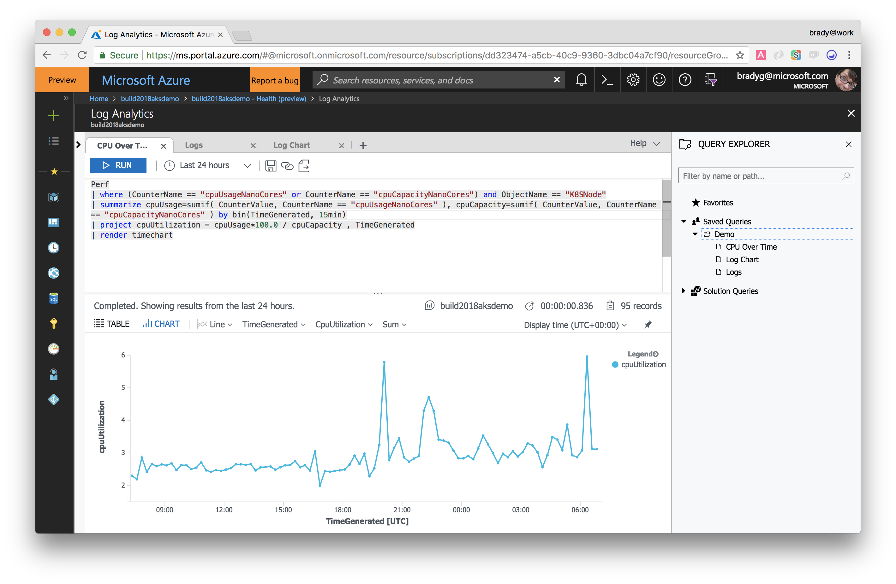

# SmartHotel360 AKS Demo Setup

All of the back-end systems run inside of Docker containers. During the installation phase you will notice errors if you haven't set your Docker configuration to use 4 GB of memory. Changing this is simple within the Docker configuration dialog. Just set the memory higher and restart Docker.

> Note: The code and deployment process are being updated to use Helm and more Kubernetes-conventional tactics, and minor changes may occur prior to the general availability of Azure Dev Spaces. Watch this repository for updates, as they'll be coming by Summer 2018. 

## Prerequisites 

* A terminal with :
    * Bash command line, which can be accomplished natively on Mac or Linux or using [Windows Subsystem for Linux] to (https://docs.microsoft.com/en-us/windows/wsl/install-win10) on Windows **-OR-**
    * Powershell environment
* [Docker](http://www.docker.com) to build the containers. 
* [Visual Studio 2017 Preview](https://www.visualstudio.com/vs/preview/) with the ASP.NET Web workload installed. 
* [Azure Dev Spaces Extension for Visual Studio](https://docs.microsoft.com/en-us/azure/dev-spaces/get-started-netcore-visualstudio#get-the-visual-studio-tools). 
* [Azure CLI](https://docs.microsoft.com/en-us/cli/azure/install-azure-cli?view=azure-cli-latest)
* [Kubernetes CLI](https://kubernetes.io/docs/tasks/tools/install-kubectl/)
* The [jq](https://stedolan.github.io/jq/) package for bash, which enables jQuery processing (Not necesary for Powershell environment) 
* [Helm](https://helm.sh/) to ease Kubernetes deployment

## Set up a Service Principal 

[Create a service principal](https://docs.microsoft.com/en-us/azure/azure-resource-manager/resource-group-create-service-principal-portal?view=azure-cli-latest) and take note of the Application ID and key. The service principal will need to be added to the **Contributor** for the subscription.

If you already have a service principal, you can re-use it, and if you don't and create one for this demo, you can re-use it to create other AKS clusters in the future. 

## Provision the Azure Resources

In this step you'll create all of the Azure resources required by the demo. This consists of an AKS Cluster and an Azure Container Registry (ACR) instance. The AKS Cluster is pre-configured to use Microsoft Operations Management Suite (OMS) and Log Analytics to enable the rich Container Health Dashboard capabilities. 

1. Clone this repository to your development machine. 
1. Install the Azure Dev Spaces **preview** extension for the Azure CLI by entering the following command. 

    ```bash
    az extension add --name dev-spaces-preview
    ```

1. (Bash) Open a bash terminal. git clone this repository. Then CD into the `setup` folder of this repository.

    (Powershell) Open a Powershell terminal. git clone this repository. Then CD into the `setup` folder of this repository.
1. Some Linux distributions require setting execute permissions on `.sh` files prior to executing them. To be safe, running the command below results in the bash scripts being enabled with execution priveleges. 

    ```bash
    chmod +x ./00-set-vars.sh
    chmod +x ./01-aks-create.sh
    chmod +x ./02-deploy-apis.sh
    chmod +x ../Backend/deploy/k8s/build-push.sh
    chmod +x ../Backend/deploy/k8s/deploy.sh
    ```

1. Set the environment variables. For Bash terminal, run the command below, replacing the parameters with your own values. The script expects following parameters:

    * `-g <resource-group>`: Resource group to use
    * `-s <subscription>`: Azure Subscription to use
    * `-n <name>`: AKS cluster name to be used
    * `-r <name>`: ACR name to be used (just name, not FQDN)
    * `-l <location>`: Location to be used. Defaults to `eastus`
    * `-c <spn-client>`: Service principal app id
    * `-p <spn-pwd>`: Service principal password
    * `-a <name>`: Name of the Sh360 app to be installed in the cluster. Defaults to  `myapp`

    ```bash
    source 00-set-vars.sh -g <resource group> -s <subscription id> -n <cluster name> -r <ACR name> -l eastus -c <service principal app id> -p <service principal password>
    ```

    If using Powershell run the command below with following parameters:

    * `-resourceGroup <resource-group>`: Resource group to use
    * `-subscription <subscription>`: Azure Subscription to use
    * `-clusterName <name>`: AKS cluster name to be used
    * `-registry <name>`: ACR name to be used (just name, not FQDN)
    * `-location <location>`: Location to be used. Defaults to `eastus`
    * `-spnClientId <spn-client>`: Service principal app id
    * `-spnPassword <spn-pwd>`: Service principal password
    * `-sh360AppName <name>`: Name of the Sh360 app to be installed in the cluster. Defaults to  `myapp`

    ```powershell
    .\00-Set-Vars.ps1 -resourceGroup <resource group> -subscription <subscription id> -clusterName <cluster name> -registry <ACR name> -location eastus -spnClientId <service principal app id> -spnPassword <service principal password>
    ```

    > **Important Note:** The only regions in which AKS and Azure Dev Spaces are currently supported are Canada East and East US. So when creating a new AKS cluster for this scenario use either **canadaeast** or **eastus** for the **AKS_REGION** variable


1. Once the script has run, create the Azure resources you'll need by running this script for Bash terminal:

    ```bash
    source 01-aks-create.sh
    ```

    For Powershell run this script:

    ```powershell
    .\01-Aks-Create.ps1
    ```

    This will also install Tiller (Helm server component) in the cluster and configure Helm to use RBAC.

Now that the AKS cluster has been created we can publish the SmartHotel360 microservice source code into it. 

## Deploy TLS certificate on cluster

To allow https usage cert-manager needs to be configured against the cluster. For this just type:

```powershell
    .\Enable-Ssl.ps1
```

Script uses the environment variables to find the cluster to use and the resource group. You can pass following parameters to the script:

* `name`: Smarthotel360 app name (defaults to env var `SH360_APPNAME`)
* `aksName`: AKS to use (defaults to env var `AKS_NAME`)
* `resourceGroup`: Resource group where AKS is (defaults to env var `AKS_RG`)
* `sslSupport`: Must be `staging` or `prod` to use the Let's Encrypt staging or production environments. Only production environment issues valid certificates. Defaults to `staging`.

## Deploy the SmartHotel360 Backend APIs

In this segment you'll build the images containing the SmartHotel360 back-end APIs and publish them into ACR, from where they'll be pulled and pushed into AKS when you do your deployment. We've scripted the complex areas of this to streamline the setup process, but you're encouraged to look in the `.sh` files to see (or improve upon) what's happening. 

>**OPTIONAL**
You may want to get telemetry marks from the Javascript and Java based Backend APIs. For it, you need to edit the file `/Source/Backend/deploy/k8s/infrastructure_values.yml` and in this section:
>```yaml
>appinsights:
>  id: "" 
>```
>update it with the _Instrumentation Key_ of your Application Insights (note that Application Insights it's not provisioned in the former step, so you must create it at this point or even use another one you have).

1. CD into the `setup` directory (if not already there) and run this command for Bash terminal:

    ```bash
    ./02-deploy-apis.sh --httpRouting
    ```

    Or for Powershell:

    ```powershell
    .\02-Deploy-Apis.ps1 -httpRouting $true
    ```

    The script will take some time to execute, but when it is complete the `az aks browse` command will be executed and the Kubernetes dashboard will open in your browser.  Details on this script can be found [here](docs/deploy/02-deploy-apis.md), so you can customize creation if you desire. The script above should be enough once the environment variables are set in the previous step. 

1. When the dashboard opens (you may need to hit refresh as it may 404 at first), some of the objects in the cluster may not be fully ready. Hit refresh until these are all green and at 100%. 

    

1. Within a few minutes the cluster will show 100% for all of the objects in it. 

    

Congratulations! You've deployed the APIs. You're 75% of the way there, now, and all that remains is to deploy the public web site. This is a good opportunity for a much-earned break!


## Save the Queries

There are three queries provided in the [`queries`](./Source/queries) folder of this repository:

* CPU chart of the entire cluster over time
* Error log containing "0 results found" log entry
* Bar chart over time of the error log containing "0 results found" log entry

To make it easy to run these queries during a demo, paste them in the Log Analytics Query Explorer and click the **Save** button, then give the query a name and category. 


Then they're readily available in the **Saved Queries** folder in the Query Explorer. 



## Success!

Now that the setup is complete, you can read the [Demo Script](./docs/02-script.md) to see how to execute the demo. Or, if you want to preload the cluster you just created with data, learn how the [preloading script can help you](./docs/03-preload.md). 
