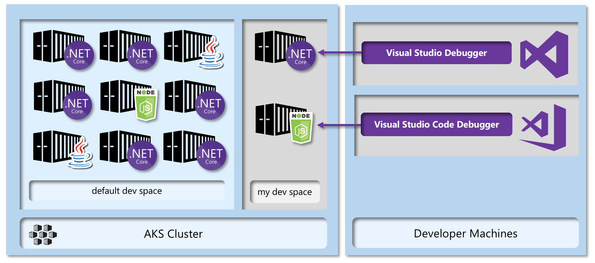

## SmartHotel360 Microservices on Azure Kubernetes Service

During the [Build 2018](http://buildwindows.com/) keynote, Scott Hanselman (with help from Scott Guthrie) showed developers the new features available in Azure Kubernetes Service and Azure Dev Spaces. To help you learn how to deploy microservices written in any framework to AKS we've updated the [SmartHotel360](http://www.smarthotel360.com) back-end microservices source code and deployment process to optimize it for AKS. You can clone, fork, or download the [AKS & Azure Dev Spaces demo](https://github.com/Microsoft/SmartHotel360-AKS-DevSpaces-Demo) at GitHub.

## Overview

Azure Kubernetes Service (AKS) gives developers the best experience for building microservices in any platform - Java, .NET Core, or Node.js, to name a few used in this demo's source code - using Kubernetes and containers. The diagram below shows a high-level snapshot of the back-end APIs housed in the AKS cluster once you deploy this repository's source code to AKS. 

[Sample queries](https://github.com/Microsoft/SmartHotel360-AKS-DevSpaces-Demo/tree/master/queries) shipped with the demo can be saved and executed in an AKS cluster to get deep visibility into how each service is running. The query below, for example, results with a bar chart showing how often a certain pattern appears in the execution logs. 

[Azure Dev Spaces](https://docs.microsoft.com/en-us/azure/dev-spaces/azure-dev-spaces) provides a rapid, iterative Kubernetes development experience for teams. With minimal dev machine setup, you can iteratively run and debug containers directly in Azure Kubernetes Service (AKS). Develop on Windows, Mac, or Linux using familiar tools like Visual Studio, Visual Studio Code, or the command line. The diagram below shows how the Visual Studio family of IDEs can connect to AKS to enable debugging within developers' Azure Dev Spaces without impacting production or teammate code. 

The AKS Cluster created by the demo contains support for Azure Dev Spaces, so that you can debug the individual services live in the Kubernetes cluster. There's a pre-wired error in the Hotels microservice you'll fix during the demo, then debug in your own Azure Dev Space to validate the fix worked. 

## Demo Contents

The [sample repository](https://github.com/Microsoft/SmartHotel360-AKS-DevSpaces-Demo/blob/blog/docs/02-script.md) contains:

* The source code and deployment for the back-end services and the public web app
* The [demo script](https://github.com/Microsoft/SmartHotel360-AKS-DevSpaces-Demo/blob/blog/docs/02-script.md) and the [setup instructions](https://github.com/Microsoft/SmartHotel360-AKS-DevSpaces-Demo/blob/master/docs/01-setup.md), written in bash, so it can be easily executed on Linux, Mac, or in Windows using [WSL](https://docs.microsoft.com/en-us/windows/wsl/about). 
* [Helm](https://helm.sh/) charts for each service
* [Sample queries](https://github.com/Microsoft/SmartHotel360-AKS-DevSpaces-Demo/tree/master/queries) for use in with AKS Log Search
* A [preloader script](https://github.com/Microsoft/SmartHotel360-AKS-DevSpaces-Demo/blob/master/docs/03-preload.md) that can be used to generate log/CPU data

The [SmartHotel360 public web site](https://channel9.msdn.com/Shows/Visual-Studio-Toolbox/SmartHotel360-Demo-App-Web-Site) was originally written to demonstrate the features that make Azure App Service the best place in the cloud to host [ASP.NET Core](https://docs.microsoft.com/en-us/aspnet/core/getting-started?view=aspnetcore-2.1&tabs=macos) applications, with amazing diagnostics, deployment, and devops features. 

AKS is a great place to host ASP.NET Core applications, too, so to give you great examples of **both scenarios**, we've moved the public web site into the AKS cluster for this sample. If you're investigating the variety of options for hosting your ASP.NET Core apps in Azure, you'll have the [original App Service-focused version](https://github.com/Microsoft/SmartHotel360-public-web) of the demo source code, and you'll learn from [the new demo repository]((https://github.com/Microsoft/SmartHotel360-AKS-DevSpaces-Demo)) how to publish an ASP.NET Core app into AKS. 

## Summary

Azure Kubernetes Service (AKS) brings so many amazing features for developers. The container health dashboard, deep log search features enabling you to really see how your code's executing in the cluster, and IDE/debugger integration that makes it possible for you to edit and debug code live in the cluster without impacting production or teammate code all make AKS the greatest experience for building apps with Kubernetes. 

We hope this demo is useful in your process of learning how to publish microservices to AKS and to make the most use of the amazing portal and debugging features. As with all of the SmartHotel360 repositories, these are open and we encourage pull requests. If you experience any issues setting it up, send us an issue in GitHub and we'll resolve it quickly. 

Thanks! We hope you enjoy this AKS-optimized demonstration. 