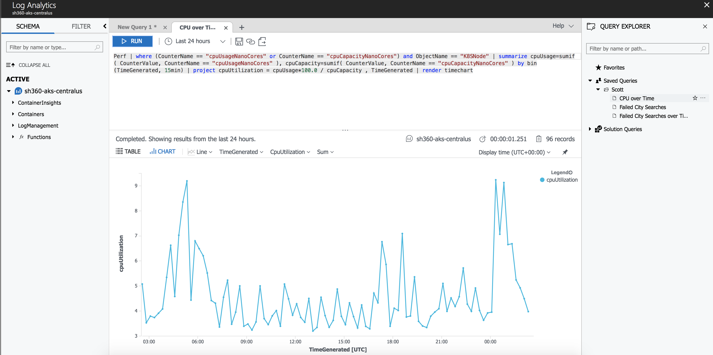

# Log and CPU Chart Pre-loader

During the demo, the AKS Container Health Dashboard view is shown. The [demo queries](../queries) are provided as a part of this repository. An image of this segment of the demo is shown below, with some data after the cluster has been running for some time, to show the CPU time chart. 



AKS makes it easy for developers to see their log data in the dashboard, too, both in chart and list format. The moment you look at the logs in the portal you can see the city search returning 0 results, and the line below it clearly shows which controller (the `CitiesController`) is the culprit. 


To generate these logs, a Node.js script has been provided. It simply hits the Hotels API in the AKS cluster in a variety of ways - searching for a city, searching for hotels, and so on. The code simply repeats every 10 seconds, but you can tweak this if you like. 

## Prerequisites
If you want to run the preloader, you will need to do so in an environment that supports Node.js. So you'll either need to download Node.js from the [official Node.js web site](http://nodejs.org), or use another means to install such as [Chocolatey](https://chocolatey.org/) on Windows or [HomeBrew](https://brew.sh/) on Mac OS. 

## Customizing the Script for your Cluster(s)
The code for the preload is contained in [`preloader/app.js`](../preloader/app.js), and requires one minor customization. The first line of code in [`preloader/app.js`](../preloader/app.js) is an array variable of URL bases (if you're doing this as demo it never hurts to have a backup environment). 

```javascript
const urlBases = ["http://sh360.<guid>.<region>.aksapp.io/"]
```

You'd simply change the URL to be that of your own ingress front door. An example setup might consist of the following:

```javascript
const urlBases = ["http://sh360.c40b7447-b520-4d7c-b82c-72f5e4f8e5ee.canadaeast.aksapp.io","http://sh360.0e3c804c-abd2-4445-8aad-c9dee3200185.eastus.aksapp.io/"];
```

This would result in log and CPU data being generated for two clusters, where that in East Canada is the primary and that in East US is the secondary. 

## Running the script

Running the script is easy. Simply CD into the `preloader` directory and enter the commands below. 

```
npm install
node app
```

Allow the script to run for some time, then close it. Then repeat until you have the amount of data you want for your demo. 

> Note: Don't run the script and then expect the logs to appear immediately. Sometimes it takes 5-10 minutes for logs to appear in the portal. 

As the scipt loops, it will output the request/response data so you can see how things are going. 


